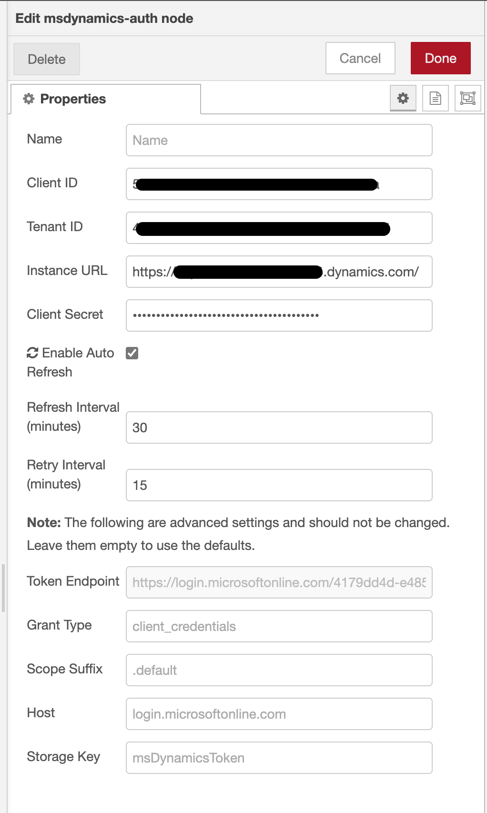

# Node-RED: MSDynamics Auth Node

This repository contains the `msdynamics-auth` Node-RED node, designed to authenticate and interact with Microsoft Dynamics 365. It simplifies the process of managing authentication tokens, ensuring seamless integration with Dynamics 365 APIs.

## Features

- Simplified authentication with Microsoft Dynamics 365.
- Automatic and configurable token refresh intervals.
- Secure handling of credentials.
- (Upcoming) Node for contact data retrieval.

## Configuration

- **Client ID and Secret**: Provide the Client ID and Secret from your Microsoft Dynamics 365 app registration.
- **Tenant ID and Instance URL**: Specify your Dynamics 365 Tenant ID and the URL of your instance.
- **Auto Refresh**: Enable to automatically refresh the authentication token. This is enabled by default.
- **Refresh Interval**: Set the interval for how often the token should be refreshed.
- **Retry Interval**: Configure the retry interval in case of token refresh failure.

### AutoRefresh Mode

**Enabled**: The node automatically refreshes the token at set intervals ('Refresh Interval' and 'Retry Interval'). In this mode, manual input and outputs are not necessary; just deploy and configure the node.
**Disabled**: Manual triggering is required for token refresh. Send any message to the input as a trigger. Monitor outputs to manage refresh results.
For both modes, the token is refreshed when the flow is deployed or Node-RED restarts.



_Configuration example of the authentication node._

## Usage

Drag and drop the msdynamics-auth node into your flow. Double-click on it to configure the necessary credentials and settings. The node handles authentication with Dynamics 365 and ensures that the token is refreshed as required. The token information is stored in the Node-RED global context under the key msDynamicsToken.
Regardless of the refresh mode, the token is refreshed when the flow is deployed or Node-RED restarts.

To directly access the `accessToken` in your flows, use the following code snippet:

```javascript
const accessToken = global.get("msDynamicsToken.accessToken");
```

If accessToken is available, it can be used for authenticated API calls to Microsoft Dynamics.


_Example of token data in Node-RED's global context._

## Inputs and Outputs

**Input**: The node has one input, used for manually triggering a token refresh. This is mainly for testing or building your own token refresh logic. The input does not process the incoming message content.
**Outputs**: There are two outputs. The first sends success messages with token details upon refresh, and the second sends error messages if the refresh fails. These outputs are optional for debugging purposes, especially useful when not using AutoRefresh.
Errors are always logged, but for detailed error messages, a debug node is recommended.

### Notes

Security Note: Storing sensitive information like access tokens in the global context allows any node in the flow to access it. Ensure to follow best security practices in handling such sensitive information.
Configuration Note: The fields for Token Endpoint, Grant Type, Scope Suffix, and Host have default values that are suitable for most use cases. Only modify these if your specific Microsoft Dynamics setup requires different values.

## License

This project is licensed under the MIT License.

## Acknowledgments

This Node-RED node was developed as part of my work at Anywhere365 and an initiative to integrate Dynamics 365 more efficiently within the Dialogue Studio low-code environment which uses a custom version of Node-RED.

## Disclaimer

This Node-RED node is an independent project and is not officially supported or affiliated with Anywhere365. It has been developed outside of Anywhere365's official channels.

**Please Note**:

- **No Affiliation**: This project is not affiliated with Anywhere365 in any official capacity. Views, opinions, and code in this node are solely those of the author(s) and do not represent those of Anywhere365.
- **Use at Your Own Risk**: Users should use this node at their own risk. While efforts have been made to ensure reliability and safety, Anywhere365 or the author(s) cannot be held responsible for any damages, data loss, or other issues arising from the use of this node.
- **No Warranty**: This node is provided "as is" without any warranties of any kind, either express or implied. Users are responsible for testing and validating its functionality in their specific environment.
- **I am not a developer**: The author of this nodes is not a developer. This a project developed in my free time and heavily relying on chatGPT for code help. With that in mind, please set your expectations right :)
