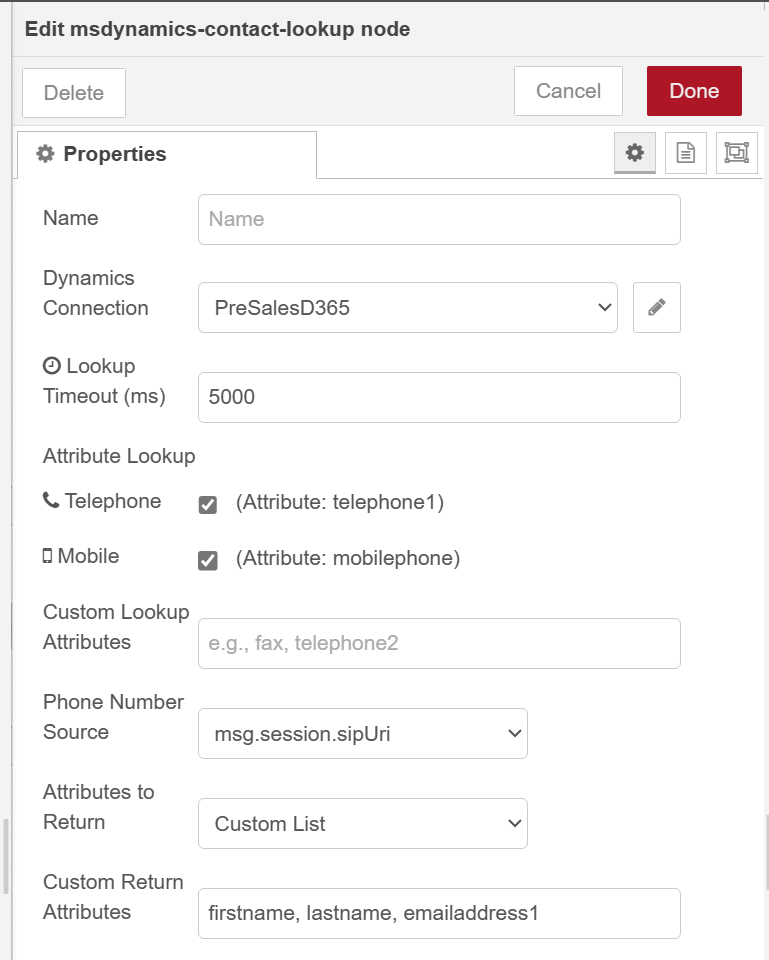
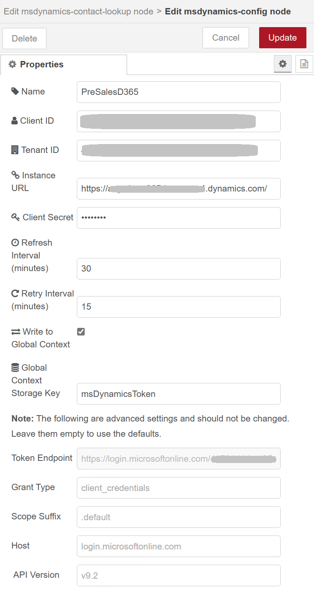
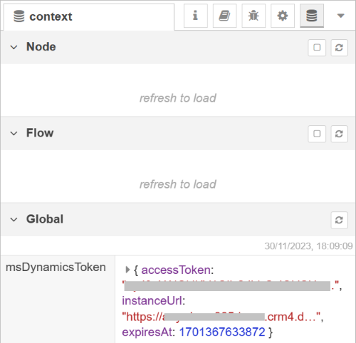

# Node-RED: MSDynamics Nodes

This repository contains the `msdynamics-contact-lookup` Node-RED node, designed to lookup a contact in MS Dynamics based on a phone number. Authentication with Microsoft Dynamics 365 is handeled by a built-in configuration node. This simplifies the process of managing authentication tokens, ensuring seamless integration with Dynamics 365 APIs and paves the way for easier addition of new nodes.

# Contact Lookup Node

Searches for contacts in Microsoft Dynamics using a provided phone number

## Inputs and Outputs

**Input**: Expects a message with one of the selected paths containing the phone number to look up. The node cleans up the phone number from the input message by removing domain suffixes, empty space and any non-numeric characters except for the leading plus sign.

**Outputs**:

- **One Contact Found**: Outputs the contact data if exactly one match is found.
- **No or Multiple Contacts Found**: Outputs if no contacts or multiple contacts are found.
- **Error/Timeout**: Outputs if an error occurs or the request times out.

## Configuration

- **Dynamics Connection**: Select the Microsoft Dynamics configuration node.
- **Lookup Timeout**: Time in milliseconds before the lookup request is aborted (default 3000 ms).
- **Attribute Lookup**:
  - **Telephone**: Enables searching the <code>telephone1</code> field.
  - **Mobile**: Enables searching the <code>mobilephone</code> field.
- **Phone Number Source**:
  - **<code>msg.session.sipUri</code>**: Anywhere365 Dialogue Cloud V3 (default).
  - **<code>msg.dialogue.initiator.platformParticipantId</code>**: Anywhere365 Dialogue Cloud Infinitiy.
  - **<code>msg.payload.q</code>**: Anywhere365 V3 WebAgent CRM Read integration.
  - **Custom Attribute**: Any other custom path you might need to use.
- **Custom Attribute Path**: When **Custom Attribute** is selected this additional input field is presented. Enter the full path to where the phone number is stored. For example, <code>msg.myCustomAttribute</code>
- **Attributes to Return**:
  - **All Attributes**: All attributes of the entity in Dynamics will be returned. Note that this might result in slow responses.
  - **Custom List**: Speciffy which attributes to return.
- **Custom Return Attributes**: When **Custom List** is selected this additional input field is presented. Enter a comma-separated list of attributes you want to be returned. For example, <code>firstname, lastname, emailaddress1</code>



_Example of Contact Lookup node and the returned data._

## Usage

The node constructs a query based on the selected options (telephone/mobile) and performs a lookup. Connect the input to an Incoming call node in Dialogue Studio. Ensure the MS Dynamics config node is properly set up with valid credentials. The node outputs detailed information including HTTP response headers and status codes for further processing.

# Configuration Node

This configuration manages authentication with Microsoft Dynamics by handling access token generation and refresh. Nodes that use it can reuse the token and connection configuration to Dynamics directly. If using the standard nodes that come with this bundle, you do not need to take care of tokens, etc.
For use cases where you want to build aditional lookups that are not part of the functionality that comes with the nodes in this bundle, the refreshed access token can optionally be made availalbe in the Node-RED global context under the key `msDynamicsToken`, which includes the `accessToken` string, the `expiresAt` timestamp and the `instanceUrl`.

Features:

- Simplified authentication with Microsoft Dynamics 365.
- Automatic and configurable token refresh intervals.
- Secure handling of credentials.

## Configuration

- **Client ID and Secret**: Provide the Client ID and Secret from your Microsoft Dynamics 365 app registration.
- **Tenant ID and Instance URL**: Specify your Dynamics 365 Tenant ID and the URL of your instance.
- **Refresh Interval (minutes)**: Set the interval for how often the token should be refreshed.
- **Retry Interval (minutes)**: Configure the retry interval in case of token refresh failure.
- **Write to Global Context**: Write token information to a global context object.
- **Global Context Storage Key**: The key for the global context variable under which you want the token information to be written. Default is `msDynamicsToken`.



_Configuration example of the MS Dynamics Connection Configuration node._

## Usage

The MS Dynamics Connection settings are done via one of the standard nodes in this bundle. Deploy one of them and in the settings from the "Dynamics Connection" menu select "add new...". Configure the necessary credentials and settings. The node handles authentication with Dynamics 365 and ensures that the token is refreshed as required. Token refresh is also triggered every time the flow is deployed or Node-RED restarts.

Token information is optionally stored in the Node-RED global context under the key msDynamicsToken which contains the following fields:

- `accessToken`
- `expiresAt`
- `instanceUrl`

To directly access the `accessToken` in your flows, use the following code snippet:

```javascript
const accessToken = global.get("msDynamicsToken.accessToken");
```

Storing token information in the global context is not needed when using the standard nodes that come in this bundle as they have direct access to the token.



_Example of token data in Node-RED's global context._

## Notes

Security Note: Storing sensitive information like access tokens in the global context allows any node in the flow to access it. Ensure to follow best security practices in handling such sensitive information.
Configuration Note: The fields for Token Endpoint, Grant Type, Scope Suffix, and Host have default values that are suitable for most use cases. Only modify these if your specific Microsoft Dynamics setup requires different values.

# License

This project is licensed under the MIT License.

# Acknowledgments

This Node-RED node was developed as part of my work at Anywhere365 and an initiative to integrate Dynamics 365 more efficiently within the Dialogue Studio low-code environment which uses a custom version of Node-RED.

# Disclaimer

This Node-RED node is an independent project and is not officially supported or affiliated with Anywhere365. It has been developed outside of Anywhere365's official channels.

**Please Note**:

- **No Affiliation**: This project is not affiliated with Anywhere365 in any official capacity. Views, opinions, and code in this node are solely those of the author(s) and do not represent those of Anywhere365.
- **Use at Your Own Risk**: Users should use this node at their own risk. While efforts have been made to ensure reliability and safety, Anywhere365 or the author(s) cannot be held responsible for any damages, data loss, or other issues arising from the use of this node.
- **No Warranty**: This node is provided "as is" without any warranties of any kind, either express or implied. Users are responsible for testing and validating its functionality in their specific environment.
- **I am not a developer**: The author of this nodes is not a developer. This a project developed in my free time and heavily relying on chatGPT for code help. With that in mind, please set your expectations right :)
